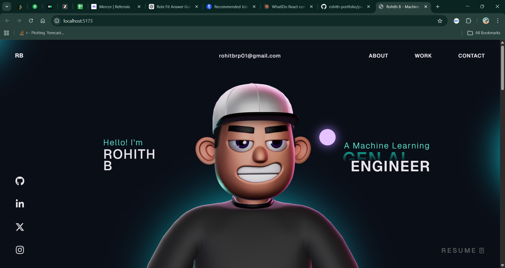

# Rohith B — Machine Learning Engineer Portfolio 🚀



> Results-driven Machine Learning Engineer specializing in Generative AI, RAG-based systems, and End-to-End ML Pipelines. Dual Microsoft Azure Certified (AI-102 & DP-100).

🌐 **Live Site:** [rohith-portfolio.vercel.app](https://rohith-portfolio.vercel.app)

---

## 👨‍💻 About Me

I'm **Rohith B**, an ML Engineer based in **Bengaluru, India**, with expertise in building production-ready ML systems and GenAI-powered applications. Currently pursuing M.Tech in Artificial Intelligence at REVA University.

- 📧 rohitbrp01@gmail.com
- 💼 [LinkedIn](https://linkedin.com/in/rohithb2001)
- 🐙 [GitHub](https://github.com/RohithB01)

---

## 🛠️ Tech Stack


**Portfolio built with:** React, TypeScript, GSAP, Three.js, WebGL, HTML, CSS, JavaScript

**ML/AI Skills:** Python, Scikit-learn, LangChain, FAISS, RAG, LLMs, Pandas, NumPy, Streamlit, Power BI, SQL

---

## 📂 Featured Projects

### 1. 🛡️ Credit Card Fraud Detection
> End-to-End ML pipeline for real-time fraud risk scoring

- Built on **284,807 real transactions** with 0.17% fraud rate
- Achieved **96% ROC-AUC** and **92% recall** on minority class
- Handled class imbalance using **SMOTE** and class-weight tuning
- Deployed as an interactive **Streamlit** app
- **Tools:** Python, Pandas, Scikit-learn, Streamlit, SMOTE, Random Forest

---

### 2. 📄 Document Intelligence System (RAG)
> GenAI-powered document Q&A with citation-backed responses

- Queries across **500+ page unstructured PDFs** using RAG
- Reduced irrelevant context retrieval by **~40%** vs keyword search
- Integrated **LLMs via LangChain** to reduce hallucinations
- Sub **3-second response latency** on Streamlit interface
- **Tools:** Python, LangChain, LLMs, FAISS, RAG, Streamlit, Azure AI

---

### 3. 📊 Customer Churn Prediction
> ML analytics system with Power BI retention dashboard

- Analyzed **7,043 customer records** to identify top churn drivers
- Achieved **88% ROC-AUC** and **85% recall** for at-risk customers
- Built interactive **Power BI dashboard** for retention insights
- Projected **12–15% improvement** in retention campaign efficiency
- **Tools:** Python, Scikit-learn, Pandas, Streamlit, Power BI

---

## 🏅 Certifications

- 🥇 Microsoft Certified: **Azure AI Engineer Associate (AI-102)**
- 🥇 Microsoft Certified: **Azure Data Scientist Associate (DP-100)**
- ✅ Machine Learning with TensorFlow on Google Cloud — Udemy
- ✅ GenAI Mastery — Udemy
- ✅ AWS Academy Machine Learning Foundations — AWS
- ✅ Python 101 for Data Science — IBM
- ✅ SQL and Relational Databases 101 — IBM

---

## 🚀 Running Locally

```bash
# Clone the repository
git clone https://github.com/RohithB01/rohith-portfolio.git

# Navigate to the project
cd rohith-portfolio

# Install dependencies
npm install

# Start the development server
npm run dev
```

> **Note:** This portfolio uses GSAP animations. For Club GSAP plugins, check out [gsap.com/docs/v3/Installation](https://gsap.com/docs/v3/Installation/)

---

## 📄 License

This project is open source and available under the [MIT License](LICENSE).

---

<p align="center">Made with ❤️ by <a href="https://github.com/RohithB01">Rohith B</a></p>
